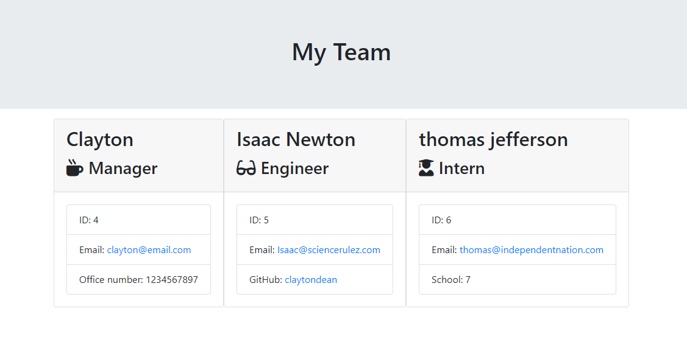
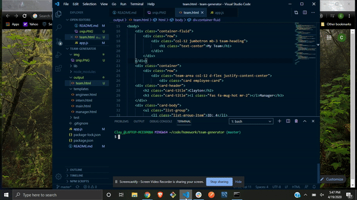
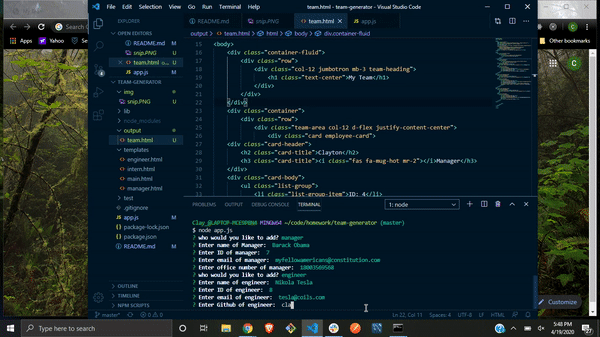

# team-generator


```
The user creates their team using prompts that generate either 'manager', 'engineer', or 'intern'. Each of these prompts vary between linking to github, ID's, school, email, name, and office number. Created using Node.js, inquirer, and jest.
```



